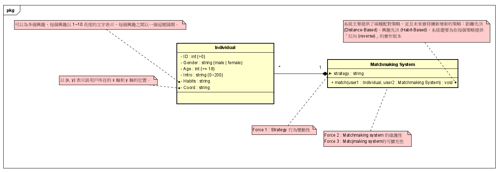
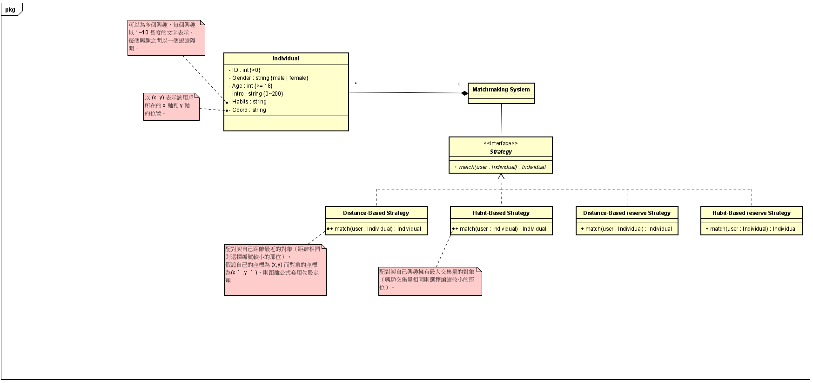

# matchmaking

## 需求書

你正在開發一個交友配對系統 (Matchmaking System)。

1. 你手邊有一大群對象 (Individual) 資料，每一筆資料皆記載著以下欄位：
    1. 編號 (ID)：正整數 (>0)，每位對象的編號都不同。
    2. 性別 (Gender)：`MALE` 表示男生、`FEMALE` 表示女生
    3. 年紀 (Age)：正整數；至少 18 歲。
    4. 自我介紹 (Intro)：長度約 0~200 的文字。
    5. 興趣 (Habits)：可以為多個興趣，每個興趣以 1~10 長度的文字表示，每個興趣之間以一個逗號隔開。例如：`打籃球, 煮菜, 玩遊戲`
    6. 座標 (Coord)：以 `(x, y)` 表示該用戶所在的 x 軸和 y 軸的位置。
2. 你要撰寫一個配對系統 (Matchmaking System)，**系統會幫每位用戶配對最適合他的用戶，** 而你的系統主要提供了兩種配對策略，並且未來會持續新增新的策略：
    1. **距離先決 (Distance-Based)：** 配對與自己距離最近的對象（距離相同則選擇編號較小的那位）。
        1. 假設自己的座標為 (*x*,*y*) 而對象的座標為(*x*′,*y*′)，則距離公式為：(*y*−*y*′)2＋(*x*−*x*′)2
            
    2. 興趣**先決 (Habit-Based)：** 配對與自己興趣擁有最大交集量的對象（興趣交集量相同則選擇編號較小的那位）。
3. 不過，也有用戶喜歡認識更多元的人，因此你的系統還要為你每個策略提供**「反向 (reverse)」**的實作版本，像是把距離先決的策略改成是配對與自己距離最遠的對象，而把興趣先決改成是配對與自己興趣擁有**最小交集量**的對象。

## **設計需求**

1. 由於客戶會不斷研發新的配對策略，我們希望系統能夠允許 Client (程式中系統的使用方，通常會是你的 **Main method**）在外部抽換系統的配對策略。

## OOA

## OOD
